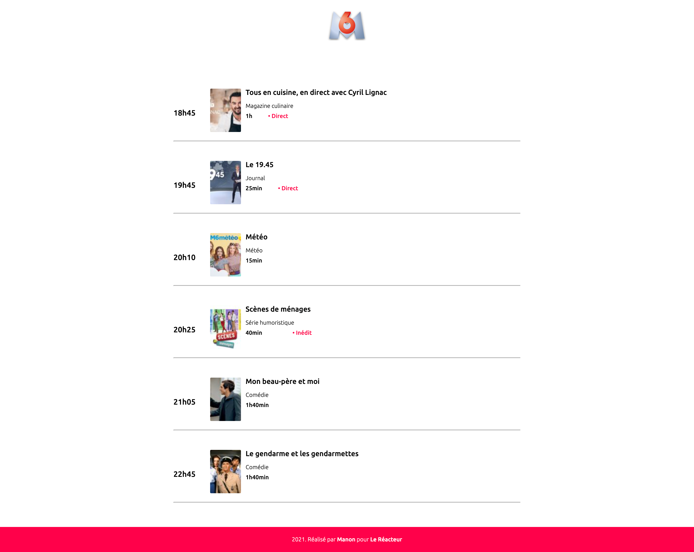

# TV PROGRAM 📺

🌤 April 2021  
✨ Frontend - (first ReactJS exercice 🤗)

## 🌈 Overview - Welcome dude

---

TV program made at [Le Reacteur](https://www.lereacteur.io/) Bootcamp.  
1 screen is available: M6 TV program page.

## 👩🏻‍💻 Tasks

---

✘ Create components  
✘ Do integration (CSS and React)  
✘ Make responsive

## 📚 Stacks

---

[Javascript](https://www.w3schools.com/js/default.asp)  
[ReactJS](https://fr.reactjs.org/docs/getting-started.html)  
[HTML5](https://www.w3schools.com/html/default.asp)  
[CSS3](https://www.w3schools.com/css/default.asp)

## 🗝 Installation and usage

---

Simple exercice, simple installation.

### 🚙 Running the project

1️. Clone this repository

`git clone https://github.com/manon-boiteau/prog-tv-LeReacteur.git`

`cd prog-tv-LeReacteur`

2️. Install packages

`npm install`  
or  
`yarn`

3️. When installation is complete:

`yarn start`

🙏🏻 Thank you @LeReacteur.
